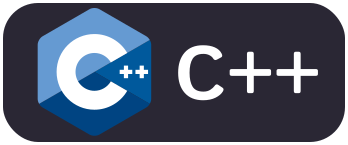
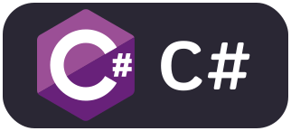

<h1 align="center">
    
</h1>

<h3 align="center">An Exceptional Software Developer from Peru 🇵🇪</h3>

 

 
 👨‍💻 I'm currently pursuing a degree in **Computer Science**

📚 Currently expanding my knowledge in **React, Golang, and C# .NET Framework**

 

 
  
  
  

 

 
<h2 align="center">🚀 Tech Universe: Languages, Frameworks, and Tools 🛠️</h2>
 

  
  
  
  
  
  
  
  
  
  
  
  
  
  
  
  
  
  
  
  
  
  
  
  
  
  
  

 

  <h2>🐍 My Contributions 🐍</h2>
   
  
  
     

<h2 align="center">💥 Stats 💥</h2>
 

  
   
   
  
   
   
  

  

<h3 align="center">
  
</h3>

 

 

###

  

